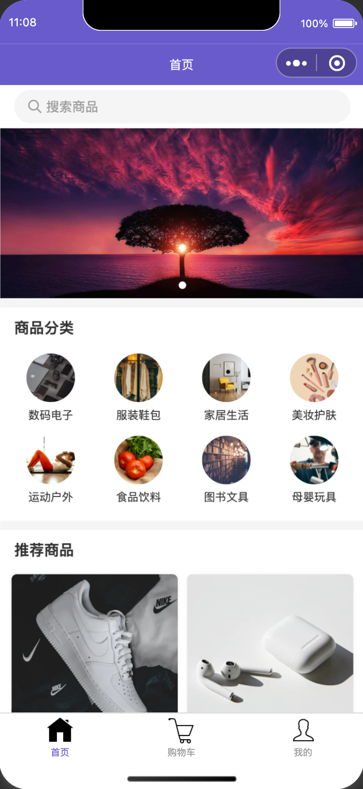

# 小程序电商小程序项目

一个基于微信小程序 + 腾讯云开发（CloudBase）的完整开发模板，提供了云开发核心功能演示和最佳实践，帮助开发者快速构建小程序云端应用。

## 💻 效果演示



## 📝 AI开发提示词记录

[](https://github.com/TencentCloudBase/CloudBase-AI-ToolKit)

> 本项目基于 [**CloudBase AI ToolKit**](https://github.com/TencentCloudBase/CloudBase-AI-ToolKit) 开发，通过AI提示词和 MCP 协议+云开发，让开发更智能、更高效，支持AI生成全栈代码、一键部署至腾讯云开发（免服务器）、智能日志修复。

首先可以按照 [CloudBase AI ToolKit 快速上手指南](https://docs.cloudbase.net/ai/cloudbase-ai-toolkit/getting-started) 准备好 AI 开发环境。

以下是开发本项目时使用的完整提示词，展示了如何通过自然语言与AI协作完成电商小程序开发：

<details>
<summary><strong>阶段一：项目初始化和首页开发</strong></summary>

```
我想开发一个电商小程序，功能要求：

1. 完整的电商功能：商品展示、购物车、订单管理、用户中心
2. 基于微信小程序原生框架开发
3. 使用腾讯云开发作为后端服务
4. 支持微信支付功能
5. 具备现代化的UI设计和良好的用户体验

请用微信小程序原生框架做前端，腾讯云开发做后端，帮我开发这个电商小程序。
```

</details>

<details>
<summary><strong>阶段二：首页模块详细开发</strong></summary>

```
# 你是一名微信小程序开发专家，当前项目是一个电商小程序，你的目标是基于当前项目生成首页模块的完整代码，其中包含小程序前端以及数据库部分

## 前端要求：

1. 使用WXML+WXSS+JS组合
2. 包含以下组件：
   - 顶部搜索栏，点击跳转到搜索页，搜索页支持历史记录，支持过滤查询
   - 轮播图（从云数据库读取轮播图数据）
   - 商品分类网格（4x2布局）（从云数据库读取分类数据）
   - 推荐商品流（2列布局，支持分页加载，触底加载，下拉刷新）
3. 交互要求：
   - 轮播图自动播放+指示器
   - 商品卡片点击跳转详情页
   - 分类点击跳转分类商品页

## 数据库设计：

   - swipers集合字段：imageUrl, jumpPath, sort, title, isActive
   - products集合字段：name, price, originalPrice, sales, coverUrl, categories, description, stock
   - categories集合字段：name, imageUrl, sort, isActive

## 输出要求：
1. 请严格按照我的要求输出完整模块代码，并标注关键逻辑注释
2. 所用到的数据库请调用cloudbase MCP进行创建数据库
3. 请往数据库中添加一些mock数据，图片素材请使用 Unsplash 在线链接
4. 获取数据的方法请放到services文件夹内按模块划分
5. js代码用es6进行编写
6. 所有数据通过小程序端获取数据方式获取
7. 请以顶级UX的眼光和审美标准，创造令人满意的设计
8. 每个页面均需采用 iOS App 的风格生成
```

</details>

<details>
<summary><strong>阶段三：商品详情页开发</strong></summary>

```
接下来帮我生成商品详情页面，要求如下：

1. 页面布局：
   - 商品轮播图（支持放大查看）
   - 商品基本信息（名称、价格、销量、评分）
   - 商品详情描述（富文本展示）
   - 用户评价列表（分页加载）
   - 底部操作栏（加入购物车、立即购买）

2. 交互功能：
   - 图片预览和缩放
   - 规格选择（颜色、尺寸等）
   - 数量选择器
   - 收藏功能
   - 分享功能

3. 数据绑定：
   - 从路由参数获取商品ID
   - 动态加载商品详情数据
   - 实时更新库存状态

你可以引用vant组件库来提升开发效率，如果使用了外部组件库，记得需要安装配置。
同时帮我创建一个.gitignore文件来管理版本控制。
```

</details>

<details>
<summary><strong>阶段四：用户中心模块开发</strong></summary>

```
接下来帮我开发「我的」模块，要求如下：

作为小程序开发者，生成用户中心页面代码：

1. 布局模块：
   - 用户信息卡（显示头像+昵称，调用wx.getUserProfile获取用户信息）
   - 订单状态卡片（待付款/待发货/待收货/已完成，带数量小红点）
   - 功能入口网格（我的收藏/优惠券/收货地址/客服咨询等）
   - 设置选项（账号安全、隐私设置、关于我们）

2. 交互需求：
   - 点击头像可以重新授权获取用户信息
   - 点击订单状态跳转对应订单列表页面
   - 退出登录按钮（清除云开发登录态和本地缓存）
   - 各功能入口跳转对应页面

3. 数据绑定：
   - 用户信息从云数据库users集合获取
   - 订单状态统计从orders集合实时查询
   - 收藏数量从favorites集合统计

4. 数据库设计：
   - users集合字段：openid, nickName, avatarUrl, phone, lastLogin, createTime
   - orders集合字段：openid, orderNo, status, totalAmount, paymentTime, products, address
   - favorites集合字段：openid, productId, createTime
```

</details>

<details>
<summary><strong>阶段五：支付功能集成</strong></summary>

请先在云开发控制台安装「微信支付」模版，然后再让AI继续生成完整的支付功能代码。

```
接下来集成微信支付功能，可以参考 wxpayFunctions/wxpay_order 方法，要求如下：

1. 支付流程设计：
   - 商品加入购物车
   - 购物车结算页面
   - 订单确认和地址选择
   - 调用微信支付
   - 支付结果处理

2. 云函数开发：
   - 创建支付订单云函数
   - 微信支付统一下单
   - 支付结果回调处理
   - 订单状态更新

3. 数据库设计：
   - orders集合：订单主表
   - order_items集合：订单商品明细
   - payments集合：支付记录
   - addresses集合：收货地址

注意：
- 需要配置微信商户号
- 处理支付安全验证
- 实现支付状态实时同步
- 添加支付失败重试机制
```

</details>

<details>
<summary><strong>阶段六：购物车和订单管理</strong></summary>

```
完善购物车和订单管理功能：

1. 购物车功能：
   - 商品添加到购物车
   - 购物车商品列表展示
   - 商品数量修改和删除
   - 全选和批量删除
   - 结算功能

2. 订单管理：
   - 订单列表（全部/待付款/待发货/待收货/已完成）
   - 订单详情页面
   - 订单状态跟踪
   - 取消订单和申请退款
   - 确认收货和评价

3. 数据库设计：
   - cart集合：购物车数据
   - orders集合：订单数据
   - order_items集合：订单商品明细
   - reviews集合：商品评价

4. 交互要求：
   - 实时计算购物车总价
   - 库存不足提示
   - 订单状态实时更新
   - 支持订单搜索和筛选
```

</details>

> 💡 **学习要点**：通过这些提示词可以看出，AI开发小程序的关键是**模块化开发**，从基础功能到复杂业务逻辑，逐步完善整个电商系统的各个环节。

## 🤖 项目特色

这是一个**AI编程实践案例**，从需求分析到完整电商小程序，全程通过与AI对话完成开发：

- 🧠 **纯AI开发**：通过自然语言描述需求，AI生成全部代码
- 🎯 **学习参考**：展示AI辅助开发小程序的完整workflow和最佳实践
- 📚 **提示词分享**：公开完整的开发提示词，供学习参考
- 🚀 **一键部署**：结合CloudBase AI ToolKit实现智能部署
- � **最佳实践**：展示小程序 + CloudBase电商应用的标准架构
- � **完整功能**：涵盖电商小程序的核心业务流程
- ☁️ **云端一体**：深度集成腾讯云开发，前后端统一开发

## 项目特点

* 📄 **小程序完整能力**：展示小程序前端开发的核心功能
* 🚀 **云开发后端服务**：集成云函数、数据库、存储等云端能力
* 🤖 **AI IDE 智能化**：集成 AI 编程规则，提供智能化开发体验
* ☁️ **云开发 MCP 集成**：一站式云服务开发部署体验
* 🎁 **CloudBase 深度集成**：充分利用腾讯云开发的强大能力
* 🔄 **实时数据同步**：支持云端数据实时更新
* 🛡️ **安全身份认证**：基于微信用户体系的安全认证
* 📊 **完整开发流程**：从开发到部署的完整工作流

## 项目架构

### 小程序技术栈

* **框架**：微信小程序原生框架
* **开发工具**：微信开发者工具
* **云开发SDK**：小程序云开发 SDK
* **UI组件**：小程序原生组件 + 自定义组件
* **状态管理**：小程序原生数据绑定

### 云开发资源

本项目使用了以下腾讯云开发（CloudBase）资源来实现完整的电商功能：

#### 1. 数据库集合

- **`swipers`**: 首页轮播图集合
  - `_id`: 轮播图ID
  - `imageUrl`: 图片链接
  - `jumpPath`: 跳转路径
  - `title`: 轮播图标题
  - `sort`: 排序权重
  - `isActive`: 是否启用

- **`categories`**: 商品分类集合
  - `_id`: 分类ID
  - `name`: 分类名称
  - `imageUrl`: 分类图标
  - `sort`: 排序权重
  - `isActive`: 是否启用

- **`products`**: 商品信息集合
  - `_id`: 商品ID
  - `name`: 商品名称
  - `price`: 现价
  - `originalPrice`: 原价
  - `sales`: 销量
  - `coverUrl`: 商品封面图
  - `images`: 商品图片数组
  - `categories`: 所属分类
  - `description`: 商品描述
  - `stock`: 库存数量
  - `status`: 商品状态

- **`users`**: 用户信息集合
  - `_id`: 用户ID
  - `openid`: 微信用户唯一标识
  - `nickName`: 用户昵称
  - `avatarUrl`: 头像链接
  - `phone`: 手机号
  - `lastLogin`: 最后登录时间
  - `createTime`: 注册时间

- **`orders`**: 订单信息集合
  - `_id`: 订单ID
  - `openid`: 用户标识
  - `orderNo`: 订单号
  - `status`: 订单状态（待付款/待发货/待收货/已完成）
  - `totalAmount`: 订单总金额
  - `paymentTime`: 支付时间
  - `products`: 商品明细
  - `address`: 收货地址
  - `createTime`: 创建时间

- **`cart`**: 购物车集合
  - `_id`: 购物车项ID
  - `openid`: 用户标识
  - `productId`: 商品ID
  - `quantity`: 商品数量
  - `createTime`: 添加时间

- **`addresses`**: 收货地址集合
  - `_id`: 地址ID
  - `openid`: 用户标识
  - `name`: 收货人姓名
  - `phone`: 联系电话
  - `province`: 省份
  - `city`: 城市
  - `district`: 区县
  - `detail`: 详细地址
  - `isDefault`: 是否默认地址

#### 2. 云函数

- **`getOpenId`**: 用户身份获取云函数
  - 获取用户的 `openid`（用户唯一标识）
  - 获取小程序的 `appid`
  - 获取用户的 `unionid`（开放平台统一标识）
  - 返回用户基本信息用于身份认证

- **`wxpayFunctions`**: 微信支付云函数
  - 处理微信支付相关逻辑
  - 调用云支付API
  - 生成支付参数
  - 返回支付结果

- **`wxpay_transaction_callback`**: 微信支付回调云函数
  - 处理微信支付结果通知
  - 更新订单状态
  - 处理支付成功后的业务逻辑
  - 返回处理结果

## 开始使用

### 前提条件

* 安装微信开发者工具 ([官方下载地址](https://developers.weixin.qq.com/miniprogram/dev/devtools/download.html))
* 拥有微信小程序账号 ([注册地址](https://mp.weixin.qq.com/))
* 开通腾讯云开发服务 ([腾讯云开发官网](https://tcb.cloud.tencent.com/))

### 配置云开发环境

**学习实践：如何配置小程序云开发环境**

#### 1. 创建云开发环境

1. 在微信开发者工具中打开项目
2. 点击工具栏中的"云开发"按钮
3. 按照引导创建云开发环境
4. 记录您的环境 ID（格式类似：`your-env-id-1234567890`）

#### 2. 配置环境 ID

在小程序开发工具中，打开 `miniprogram/app.js` 文件，修改云开发环境 ID：

```javascript
wx.cloud.init({
    env: 'your-env-id', // 替换为你的实际云开发环境 ID
    traceUser: true,
});
```

将 `your-env-id` 替换为你实际的云开发环境 ID。

#### 3. 部署云函数

1. 在微信开发者工具中，右键点击 `cloudfunctions` 下各个云函数文件夹
2. 选择"上传并部署：云端安装依赖（不上传node_modules）"
3. 等待部署完成

依赖会在云函数部署时自动安装。

### 本地开发

1. **导入项目**
   - 打开微信开发者工具
   - 选择"导入项目"
   - 选择本项目目录

2. **配置AppID**
   - 在项目设置中填入你的小程序AppID
   - 如果没有AppID，可以选择"测试号"进行开发

3. **部署云函数**
   - 右键 `cloudfunctions/getOpenId` 文件夹
   - 选择"上传并部署：云端安装依赖"

4. **预览测试**
   - 点击开发工具中的"预览"按钮
   - 使用微信扫码在真机上测试

## 目录结构

```
├── cloudfunctions/                    # 云函数目录
│   ├── getOpenId/                    # 获取用户OpenID云函数
│   │   ├── index.js                  # 云函数入口文件
│   │   └── package.json              # 云函数依赖配置
│   ├── wxpayFunctions/               # 微信支付云函数
│   │   ├── index.js                  # 支付逻辑处理
│   │   └── package.json              # 依赖配置
│   └── wxpay_transaction_callback/   # 支付回调云函数
│       ├── index.js                  # 回调处理逻辑
│       └── package.json              # 依赖配置
├── miniprogram/                      # 小程序前端目录
│   ├── app.js                        # 小程序入口文件
│   ├── app.json                      # 小程序全局配置
│   ├── app.wxss                      # 小程序全局样式
│   ├── components/                   # 自定义组件目录
│   │   ├── cloudbase-badge/          # CloudBase徽章组件
│   │   ├── product-card/             # 商品卡片组件
│   │   ├── search-bar/               # 搜索栏组件
│   │   └── order-item/               # 订单项组件
│   ├── images/                       # 静态图片资源
│   │   ├── icons/                    # 图标资源
│   │   └── placeholders/             # 占位图资源
│   ├── pages/                        # 页面目录
│   │   ├── index/                    # 首页
│   │   │   ├── index.js              # 页面逻辑
│   │   │   ├── index.json            # 页面配置
│   │   │   ├── index.wxml            # 页面模板
│   │   │   └── index.wxss            # 页面样式
│   │   ├── product-detail/           # 商品详情页
│   │   ├── cart/                     # 购物车页面
│   │   ├── order/                    # 订单相关页面
│   │   │   ├── list/                 # 订单列表
│   │   │   ├── detail/               # 订单详情
│   │   │   └── confirm/              # 订单确认
│   │   ├── user/                     # 用户中心
│   │   ├── search/                   # 搜索页面
│   │   └── category/                 # 分类页面
│   ├── services/                     # 数据服务层
│   │   ├── product.js                # 商品相关接口
│   │   ├── order.js                  # 订单相关接口
│   │   ├── user.js                   # 用户相关接口
│   │   └── payment.js                # 支付相关接口
│   ├── utils/                        # 工具函数
│   │   ├── request.js                # 网络请求封装
│   │   ├── storage.js                # 本地存储封装
│   │   └── common.js                 # 通用工具函数
│   └── sitemap.json                  # 搜索优化配置
├── .gitignore                        # Git忽略文件
├── project.config.json               # 项目配置文件
└── project.private.config.json       # 私有项目配置
```

## 云函数 API

### 1. 用户身份获取 (getOpenId)

获取用户身份信息的云函数。

```javascript
// 调用方式
wx.cloud.callFunction({
  name: 'getOpenId',
  success: res => {
    console.log('用户信息:', res.result);
    // 返回数据结构：
    // {
    //   openid: 'user-openid',      // 用户唯一标识
    //   appid: 'your-appid',        // 小程序AppID
    //   unionid: 'user-unionid'     // 开放平台统一标识（可选）
    // }
  }
});
```

### 2. 微信支付 (wxpayFunctions)

处理微信支付的云函数。

```javascript
// 创建支付订单
wx.cloud.callFunction({
  name: 'wxpayFunctions',
  data: {
    action: 'createOrder',
    orderData: {
      totalAmount: 100,        // 支付金额（分）
      description: '商品购买',  // 商品描述
      orderNo: 'ORDER123456'   // 订单号
    }
  },
  success: res => {
    const { payment } = res.result;
    // 调用微信支付
    wx.requestPayment({
      ...payment,
      success: () => {
        console.log('支付成功');
      }
    });
  }
});
```

### 3. 支付回调处理 (wxpay_transaction_callback)

处理微信支付结果通知的云函数。

```javascript
// 云函数自动处理支付回调，无需手动调用
// 支付成功后会自动更新订单状态
```

## 小程序云开发功能说明

### 云开发初始化

本项目在 `miniprogram/app.js` 中初始化云开发：

```javascript
// app.js
App({
  onLaunch: function() {
    if (!wx.cloud) {
      console.error('请使用 2.2.3 或以上的基础库以使用云能力');
    } else {
      wx.cloud.init({
        env: 'your-env-id', // 云开发环境ID
        traceUser: true,    // 用户访问记录
      });
    }
  }
});
```

### 核心功能实现

#### 1. 商品数据获取

通过 `services/product.js` 封装商品相关接口：

```javascript
// 获取首页推荐商品
export const getRecommendProducts = async (page = 1, limit = 10) => {
  const db = wx.cloud.database();
  const { data } = await db.collection('products')
    .where({ status: 'active' })
    .orderBy('sales', 'desc')
    .skip((page - 1) * limit)
    .limit(limit)
    .get();
  return data;
};

// 获取商品详情
export const getProductDetail = async (productId) => {
  const db = wx.cloud.database();
  const { data } = await db.collection('products')
    .doc(productId)
    .get();
  return data;
};
```

#### 2. 购物车功能

通过 `services/cart.js` 实现购物车操作：

```javascript
// 添加商品到购物车
export const addToCart = async (productId, quantity = 1) => {
  const db = wx.cloud.database();
  const openid = await getOpenId();

  return await db.collection('cart').add({
    data: {
      openid,
      productId,
      quantity,
      createTime: new Date()
    }
  });
};

// 获取购物车列表
export const getCartList = async () => {
  const db = wx.cloud.database();
  const openid = await getOpenId();

  const { data } = await db.collection('cart')
    .where({ openid })
    .get();
  return data;
};
```

#### 3. 订单管理

通过 `services/order.js` 处理订单相关逻辑：

```javascript
// 创建订单
export const createOrder = async (orderData) => {
  const db = wx.cloud.database();
  const openid = await getOpenId();

  return await db.collection('orders').add({
    data: {
      ...orderData,
      openid,
      orderNo: generateOrderNo(),
      status: 'pending',
      createTime: new Date()
    }
  });
};

// 获取订单列表
export const getOrderList = async (status = 'all') => {
  const db = wx.cloud.database();
  const openid = await getOpenId();

  let query = db.collection('orders').where({ openid });
  if (status !== 'all') {
    query = query.where({ status });
  }

  const { data } = await query
    .orderBy('createTime', 'desc')
    .get();
  return data;
};
```

## 开发指南

### 添加新功能

1. **新增云函数**
   - 在 `cloudfunctions` 目录下创建新的云函数文件夹
   - 编写云函数逻辑和配置文件
   - 在微信开发者工具中上传部署

2. **新增页面**
   - 在 `pages` 目录下创建新页面文件夹
   - 创建页面的 `.js` 、 `.json` 、 `.wxml` 、 `.wxss` 文件
   - 在 `app.json` 中注册新页面

3. **新增组件**
   - 在 `components` 目录下创建组件文件夹
   - 编写组件逻辑、配置、模板和样式
   - 在需要使用的页面中引入组件

### 常见问题

1. **云函数调用失败**
   - 检查云函数是否正确部署
   - 确认云开发环境ID配置正确
   - 查看云函数日志排查错误

2. **用户信息获取问题**
   - 确保用户已授权登录
   - 检查云函数权限配置
   - 验证小程序AppID设置

3. **开发工具问题**
   - 确保使用最新版本的微信开发者工具
   - 检查基础库版本是否支持云开发
   - 清除缓存重新编译

## 🚀 学习实践指南

如果您想基于此项目学习小程序云开发：

1. **研究项目结构**：了解小程序 + 云开发的标准架构
2. **实践开发流程**：
   - 克隆项目到本地
   - 配置云开发环境
   - 部署云函数
   - 在真机上测试
3. **扩展功能实现**：基于模板添加自己的业务功能

## 💡 扩展学习方向

基于本项目的技术架构，您可以学习开发：

**电商增强功能**
- 商品规格选择（颜色、尺寸等）
- 优惠券和促销活动
- 会员等级和积分系统
- 商品评价和晒单
- 直播带货功能
- 拼团和秒杀活动

**业务扩展方向**
- 多商户入驻平台
- 供应链管理系统
- 客服聊天系统
- 数据分析和报表
- 营销推广工具
- 物流跟踪系统

**技术优化方向**
- 小程序性能优化
- 图片懒加载和压缩
- 数据缓存策略
- 支付安全加固
- 用户行为分析
- A/B测试框架

**核心技术要点**：电商业务流程、支付安全、数据库设计、用户体验优化

## 🚀 学习实践指南

如果您想基于此项目学习电商小程序开发：

1. **研究业务流程**：理解电商小程序的完整业务链路
2. **分析技术架构**：学习小程序 + 云开发的最佳实践
3. **实践开发流程**：
   - 克隆项目到本地
   - 配置云开发环境和数据库
   - 部署云函数和配置支付
   - 在真机上测试完整流程
4. **扩展功能实现**：基于现有架构添加新的业务功能

## 贡献指南

欢迎贡献代码、报告问题或提出改进建议！

1. Fork 项目
2. 创建功能分支 (`git checkout -b feature/AmazingFeature`)
3. 提交更改 (`git commit -m 'Add some AmazingFeature'`)
4. 推送到分支 (`git push origin feature/AmazingFeature`)
5. 开启 Pull Request

## 许可证

MIT License
